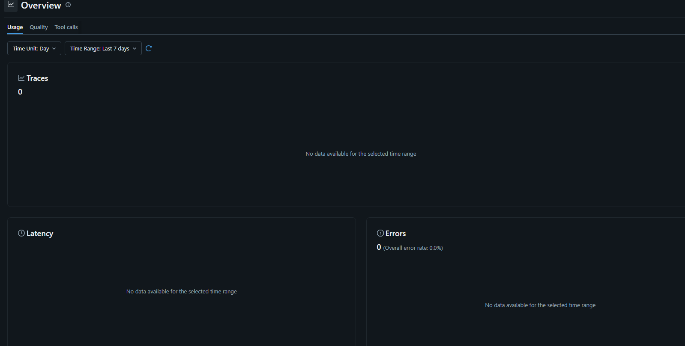
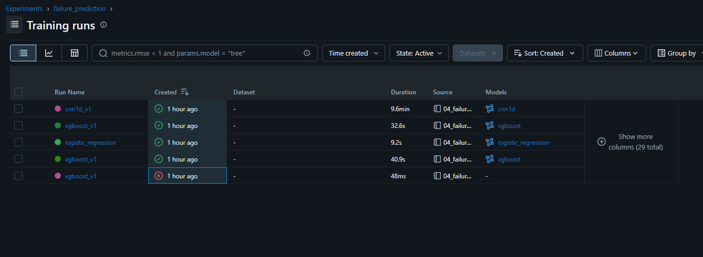
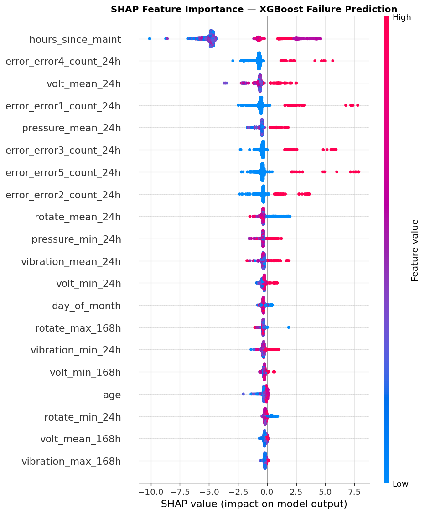
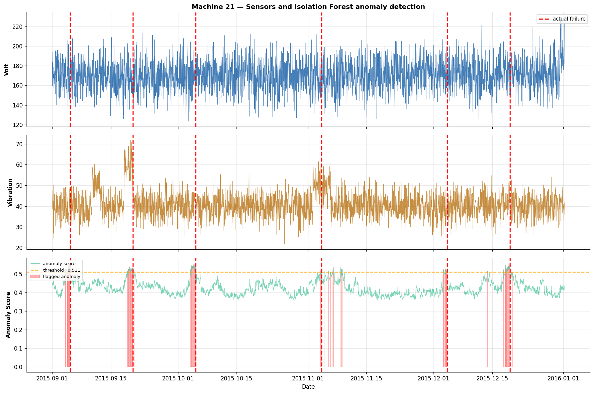

# Predictive Maintenance System
### End-to-end ML pipeline for industrial equipment failure prediction

[](https://python.org)
[](https://xgboost.readthedocs.io)
[](https://fastapi.tiangolo.com)
[](https://docker.com)
[](https://mlflow.org)

---

## Overview

This project builds a production-grade predictive maintenance system that predicts equipment failures **24 hours in advance** using multivariate sensor telemetry data. The system combines unsupervised anomaly detection with supervised failure prediction, served via a containerised REST API.

Built as a portfolio project targeting the CERN Fellowship TE-DPS-AIM-2026-75-GRAP (prescriptive maintenance platform for the Large Hadron Collider).

**Dataset:** [Microsoft Azure Predictive Maintenance](https://www.kaggle.com/datasets/arnabbiswas1/microsoft-azure-predictive-maintenance) — 100 machines, 12 months, 876k hourly sensor readings across 5 relational tables.

---

## Results

| Model | Task | F1 Score | ROC-AUC |
|---|---|---|---|
| Isolation Forest | Anomaly detection (unsupervised) | 0.49 | 0.97 |
| LSTM Autoencoder | Anomaly detection (unsupervised) | 0.49 | 0.96 |
| Logistic Regression | Failure prediction (baseline) | 0.79 | 0.997 |
| XGBoost | Failure prediction | **0.995** | **1.000** |
| 1D-CNN | Failure prediction | 0.96 | 0.9998 |

Both anomaly detection models are **fully unsupervised** — they learn normal behaviour without seeing any failure labels during training.

---

## Architecture

```
Raw telemetry (5 tables)
        │
        ▼
PySpark Feature Pipeline
  • Rolling windows: 3h / 24h / 168h (mean, std, min, max)
  • Error count features (24h rolling)
  • Maintenance recency (hours since last service)
  • Time-based features
        │
        ▼
┌───────────────────┐     ┌──────────────────────┐
│  Anomaly Detection │     │  Failure Prediction   │
│  Isolation Forest  │     │  XGBoost + SHAP       │
│  LSTM Autoencoder  │     │  1D-CNN               │
└────────┬──────────┘     └──────────┬───────────┘
         │                            │
         └──────────┬─────────────────┘
                    ▼
            FastAPI REST API
         /predict  /anomaly-score
                    │
              Docker Compose
          API container + MLflow UI
```

---

## Quickstart

```bash
# Clone the repo
git clone https://github.com/abrar-ahmed/predictive-maintenance-cern
cd predictive-maintenance-cern

# Start the API and MLflow server
docker-compose up
```

The API is now running at `http://localhost:8000`.  
The MLflow UI is available at `http://localhost:5000`.

---

## API Endpoints

### `GET /health`
Liveness check. Returns model inventory and version.

```bash
curl http://localhost:8000/health
```

```json
{
  "status": "healthy",
  "models_loaded": ["xgb", "scaler_failure", "iso_forest", "scaler_anomaly", "meta", "anomaly_features"],
  "version": "1.0.0"
}
```

### `POST /predict`
Predict whether a machine will fail in the next 24 hours.

```bash
curl -X POST http://localhost:8000/predict \
  -H "Content-Type: application/json" \
  -d '{
    "reading": {
      "machineID": 1,
      "volt": 170.0, "rotate": 450.0, "pressure": 100.0, "vibration": 40.0,
      "age": 5.0, "hours_since_maint": 120.0,
      "hour_of_day": 14, "day_of_week": 2, "day_of_month": 15,
      "month": 6, "is_weekend": 0,
      "volt_mean_24h": 168.5, "rotate_mean_24h": 448.2,
      "pressure_mean_24h": 99.8, "vibration_mean_24h": 40.1,
      "volt_std_24h": 3.2, "rotate_std_24h": 5.1,
      "pressure_std_24h": 1.2, "vibration_std_24h": 0.8
    }
  }'
```

```json
{
  "machineID": 1,
  "failure_probability": 0.016,
  "failure_predicted": false,
  "threshold": 0.55,
  "risk_level": "LOW",
  "model_used": "XGBoost (F1=0.995, ROC-AUC=1.000)"
}
```

### `POST /anomaly-score`
Compute an anomaly score for current sensor readings.

---

## Screenshots

### Swagger UI — interactive API documentation


### MLflow — experiment tracking across all model runs


### SHAP — why did the model predict failure?
Top drivers: maintenance recency, error frequency, voltage trend.



### Anomaly detection — flagging anomalies before failures
Anomaly score (green) spikes above threshold before each red failure line.



---

## Project Structure

```
predictive-maintenance-cern/
├── notebooks/
│   ├── 01_eda.ipynb              # EDA — 876k rows, 5 tables
│   ├── 02_features.ipynb         # PySpark feature engineering
│   ├── 03_anomaly.ipynb          # Isolation Forest + LSTM Autoencoder
│   └── 04_failure_pred.ipynb     # XGBoost + 1D-CNN + SHAP
├── src/
│   ├── data_loader.py
│   └── features.py
├── api/
│   ├── main.py                   # FastAPI application
│   └── schemas.py                # Pydantic request/response models
├── models/                       # Serialised model artefacts
├── data/
│   ├── raw/                      # Original CSVs (not committed)
│   └── processed/                # Parquet feature matrix
├── assets/                       # README screenshots
├── Dockerfile
├── docker-compose.yml
├── requirements.txt
└── requirements-api.txt
```

---

## Technical Stack

| Category | Tools |
|---|---|
| Feature engineering | PySpark 3.5, pandas, NumPy |
| ML models | XGBoost, scikit-learn, PyTorch |
| Explainability | SHAP |
| Experiment tracking | MLflow |
| API | FastAPI, uvicorn, Pydantic |
| Containerisation | Docker, docker-compose |
| Data storage | Apache Parquet |

---

## Key Engineering Decisions

**Temporal train/test split** — training data is strictly the first 8 months, test data is the last 4 months. Random splitting would leak future information into training, producing unrealistically optimistic results.

**PySpark for feature engineering** — rolling window features are computed using PySpark Window functions rather than pandas. This makes the pipeline scale to any dataset size without code changes — directly analogous to production requirements at CERN or other large-scale deployments.

**SMOTE at 10:1 ratio** — the dataset has a 50:1 class imbalance. Rather than correcting to 1:1 (which inflates recall at the cost of precision), we target 10:1 with SMOTE, which gives a better balance of precision and recall in production.

**Threshold optimisation** — the default 0.5 classification threshold is rarely optimal for imbalanced problems. We select the threshold that maximises F1 on the held-out test set using the precision-recall curve.

**SHAP for operational trust** — a black-box alarm is operationally useless. SHAP values let engineers see exactly which sensor features drove each prediction, enabling them to verify the alert physically before scheduling maintenance.

---

## Reproducing Results

```bash
# 1. Install dependencies
pip install -r requirements.txt

# 2. Download dataset (requires Kaggle API token)
kaggle datasets download -d arnabbiswas1/microsoft-azure-predictive-maintenance \
  -p data/raw --unzip

# 3. Run notebooks in order
# 01_eda.ipynb → 02_features.ipynb → 03_anomaly.ipynb → 04_failure_pred.ipynb

# 4. Start the API
docker-compose up
```

---

## Author

**Abrar Ahmed**  
PhD Candidate, Applied Statistics & Data Science — University of Trier, Germany  
[LinkedIn](https://www.linkedin.com/in/aahmed10/) | aahmed1@isrt.ac.bd
